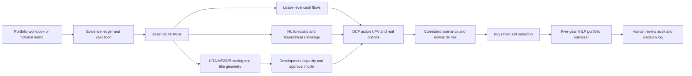
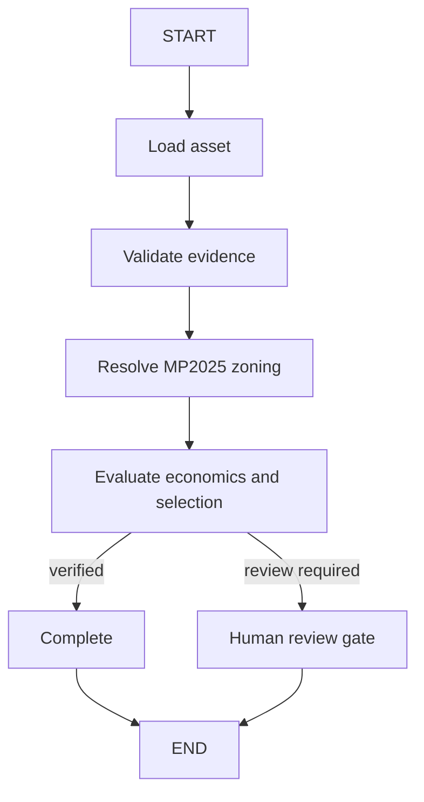
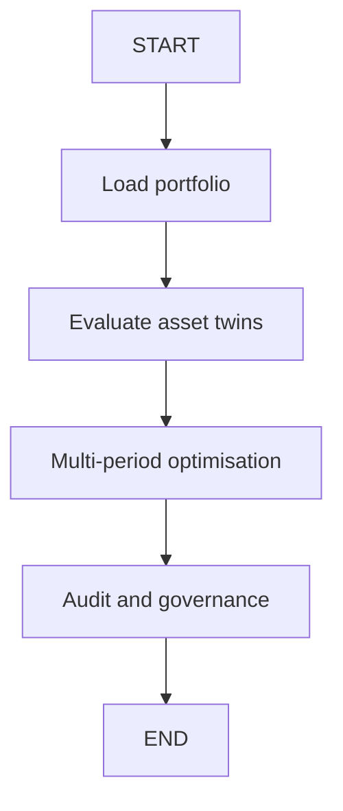

# Real Estate Portfolio Multi-Asset Quant Model

[](https://github.com/rohen97/Real-Estate-Portfolio-Multi-Asset-Quant-Model/actions/workflows/ci.yml)

A Singapore-focused multi-asset real-estate portfolio intelligence platform combining URA Master Plan zoning, property cash flows, ML forecasts, correlated scenarios, real-option valuation and multi-period portfolio optimisation.

> **Important:** This is a research and proof-of-concept system. It does not provide investment, legal, tax, valuation or planning advice. Public demo data are fictional. Real decisions require verified company data and professional review.

## Public demo

The public repository contains ten fictional Singapore assets. No private workbook, tenant data, geocode cache, title files, underwriting or private model binaries are included.

```powershell
git clone https://github.com/rohen97/Real-Estate-Portfolio-Multi-Asset-Quant-Model.git
cd Real-Estate-Portfolio-Multi-Asset-Quant-Model
./scripts/bootstrap.ps1
.venv/Scripts/python.exe scripts/create_public_demo.py
./scripts/dev.ps1
```

- Web: http://127.0.0.1:5173
- API: http://127.0.0.1:8001/docs

## Full private-data pipeline

Place private inputs under `data/input`, which is excluded from Git.

```powershell
./scripts/run-end-to-end.ps1 -PortfolioWorkbook "data/input/Far_East_Asset_List.xlsx" -CompletedUnderwritingWorkbook "completed-underwriting.xlsx"
```

For software validation only, add `-UseSyntheticPilot`. Synthetic-trained models are blocked from silent production use.

## Architecture

**[View the rendered architecture diagrams](docs/architecture/README.md)**



### Asset LangGraph



### Portfolio LangGraph



Executable graphs: `packages/orchestration/langgraph_workflow.py`. The application includes an **Architecture** page rendering the Mermaid end-to-end, asset, portfolio and training workflows.

## Core model

| Layer | Implementation |
|---|---|
| Portfolio ingestion and OneMap | `packages/data/portfolio.py` |
| Underwriting validation | `packages/data/underwriting_import.py` |
| Evidence ledger | `packages/evidence/ledger.py` |
| Asset twins | `packages/domain/twin.py` |
| URA MP2025 | `packages/zoning/ura.py` |
| Capacity and approvals | `packages/zoning/engine.py` and `approval.py` |
| Lease cash flows | `packages/valuation/lease_cashflow.py` |
| Action NPV and real options | `packages/actions/real_options.py` |
| LightGBM Ridge quantiles | `packages/forecasting/ensemble.py` |
| Hierarchical partial pooling | `packages/forecasting/hierarchical.py` |
| Approval survival | `packages/forecasting/survival.py` |
| Scenarios and covariance | `packages/scenarios/engine.py` |
| Buy retain sell selection | `packages/selection/engine.py` |
| Multi-period MILP | `packages/optimisation/multiperiod.py` |
| Legacy comparison | `packages/legacy` |
| Governance and registry | `packages/governance` |

## Selection logic in plain language

For every action, the model starts with expected incremental NPV. It adds zoning/en-bloc and transformation value, then deducts view-loss risk, competing supply and lease decay. Hold, Retrofit, Repurpose, Redevelop and Sell are compared on the same adjusted basis.

Catalogue-only assets return **Data Required / Monitor**. Transaction signals are enabled only after verified underwriting replaces proxies.

## Visualisations

The React application includes portfolio charts, MP2025 maps, action heatmaps, capacity waterfalls, zoning sensitivity, nearby-density scatterplots, scenario violin plots, a six-factor correlation matrix, action-risk ranges, selection bridges, optimiser timelines, legacy quadrants and ML diagnostics. Plotly is lazy-loaded.

## Underwriting workbook

Generate the workbook locally with:

```powershell
node scripts/build_underwriting_template.mjs
```

A private portfolio workbook is not committed because it contains asset-identifying information.

## Data policy

See `docs/repository_data_policy.md`. Never commit company workbooks, rent rolls, geocode caches, title files, valuations, debt, leases, tenant data, private model binaries or generated underwriting outputs.

## Testing

```powershell
./scripts/check.ps1
```

The local implementation currently passes 34 backend tests, frontend tests, TypeScript checks and the production build.

## Documentation

- `docs/economic_model_v2.md`
- `docs/selection_methodology.md`
- `docs/singapore_zoning_methodology.md`
- `docs/visualization_methodology.md`
- `docs/optimisation_methodology.md`
- `docs/validation_report.md`
- `docs/known_limitations.md`

## Limitations

The public demo validates software behaviour only. Production calibration requires verified NOI, valuations, leases, planning outcomes, capex delivery and realised investment decisions. Professional valuation, legal, tax, planning and governance review remain mandatory.
