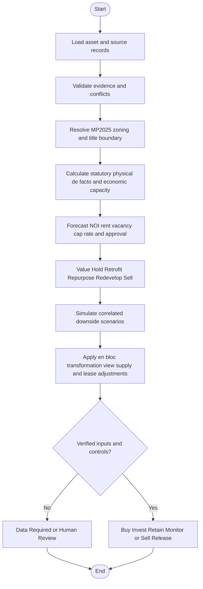

# Asset Decision Workflow

Asset-level executable LangGraph represented as Mermaid.

```mermaid
flowchart TD
  START([Start]) --> Load[Load asset and source records]
  Load --> Evidence[Validate evidence and conflicts]
  Evidence --> Zoning[Resolve MP2025 zoning and title boundary]
  Zoning --> Capacity[Calculate statutory physical de facto and economic capacity]
  Capacity --> Forecast[Forecast NOI rent vacancy cap rate and approval]
  Forecast --> Actions[Value Hold Retrofit Repurpose Redevelop Sell]
  Actions --> Risk[Simulate correlated downside scenarios]
  Risk --> Selection[Apply en bloc transformation view supply and lease adjustments]
  Selection --> Gate{Verified inputs and controls?}
  Gate -->|No| Review[Data Required or Human Review]
  Gate -->|Yes| Complete[Buy Invest Retain Monitor or Sell Release]
  Review --> END([End])
  Complete --> END
```
