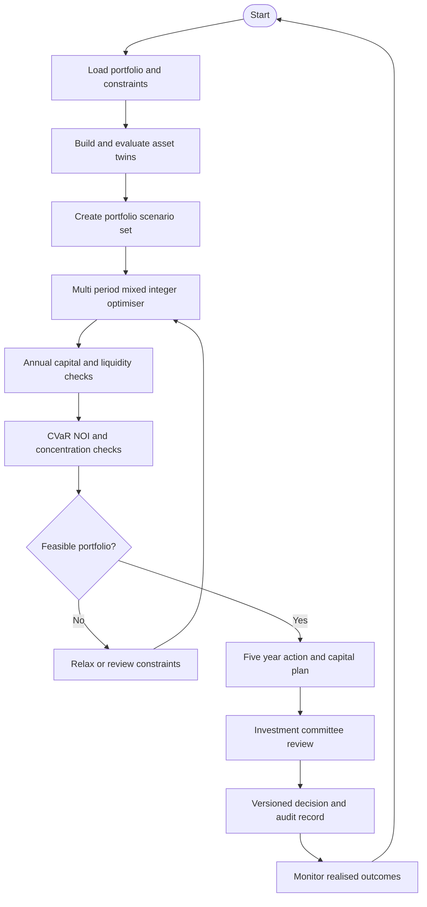

# Portfolio Decision Workflow

Portfolio evaluation and optimisation LangGraph represented as Mermaid.

```mermaid
flowchart TD
  START([Start]) --> Portfolio[Load portfolio and constraints]
  Portfolio --> Twins[Build and evaluate asset twins]
  Twins --> Scenarios[Create portfolio scenario set]
  Scenarios --> Optimiser[Multi period mixed integer optimiser]
  Optimiser --> Budget[Annual capital and liquidity checks]
  Budget --> Risk[CVaR NOI and concentration checks]
  Risk --> Feasible{Feasible portfolio?}
  Feasible -->|No| Revise[Relax or review constraints]
  Revise --> Optimiser
  Feasible -->|Yes| Plan[Five year action and capital plan]
  Plan --> Committee[Investment committee review]
  Committee --> Audit[Versioned decision and audit record]
  Audit --> Monitor[Monitor realised outcomes]
  Monitor --> START
```
